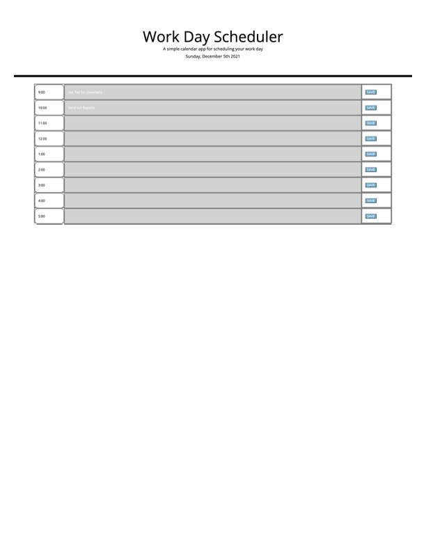

# What is this?
My repository for challenge 5 of our bootcamp. It's a workday scheduler.

## What's the point of this?
The idea is that you can log tasks you need to do each hour, and that these tasks will save when you close the window so you can reference it later. The time slots change color based on the current time, so if the time slot is in the past it is grey, if it's the current time the slot is red, and green represents the future. A save button is featured so you can save a task if you need to revisit it later!

## Stack?
Frontend:
- HTML
- CSS
- Bootstrap
Backend:
- Javascript
- jQuery

## Where can I find this page?
You can find this at my Github repository (https://github.com/mmlawton15/challenge-five-disco) or at the live url (https://mmlawton15.github.io/challenge-five-disco/).

## What does it look like?
