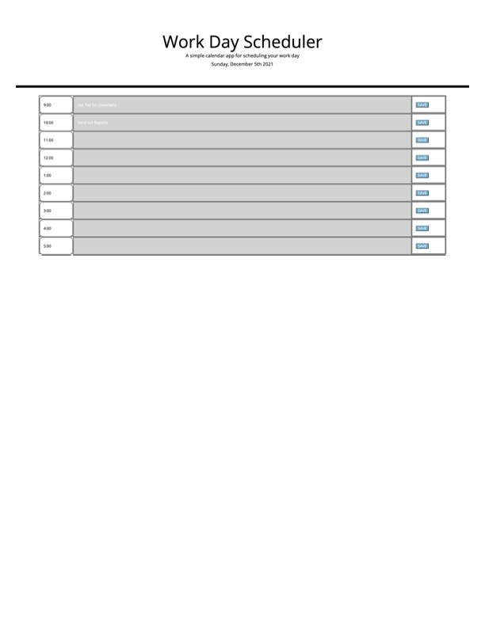

# What is this?
My repository for challenge 5 of our bootcamp. Is a workday scheduler.

## What's the point of this?
The idea is that you can log tasks you need to do each hour, and that these tasks will save when you close the window so you can reference it later.

## How did I build it?
I built this primarily from HTML and Javascript, and styled it with some CSS classes and a bit of bootstrap.

## Where can I find this page?
You can find this at my Github repository (https://github.com/mmlawton15/challenge-five-disco)

## What does it look like?
